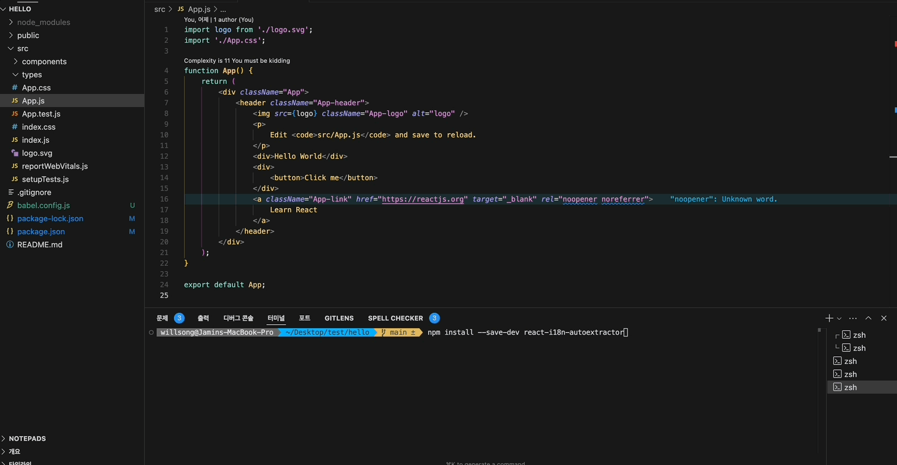

# react-i18n-autoextractor

🌍 Instant i18n for React: Transform your entire application into a multi-language ready state with a single command. No more manual text extraction, no more forgotten strings, no more i18n headaches.

> Turn 100+ hours of manual internationalization work into a 30-second automated process.



## Preview

```jsx
// Before
function App() {
    return (
        <div className="App">
            <header className="App-header">
                
                <CustomTitle>Welcome to React</CustomTitle>
                <p>
                    Edit <code>src/App.js</code> and save to reload.
                </p>
                <InfoBox>
                    You have 3 new messages
                    <StyledLink href="/messages">Check your inbox</StyledLink>
                </InfoBox>
                <div>
                    <CustomButton>Click me</CustomButton>
                </div>
            </header>
        </div>
    );
}

// Extract translations
npx i18n-extract extract

// After few seconds, you can see the generated translation files
import { i18n } from 'react-i18n-autoextractor';

function App() {
    return (
        <div className="App">
            <header className="App-header">
                
                <CustomTitle>{i18n.t('WELCOME_TO_REACT')}</CustomTitle>
                <p>
                    {i18n.t('EDIT')} <code>{i18n.t('SRC_APP_JS')}</code> {i18n.t('AND_SAVE_TO_RELOAD')}
                </p>
                <InfoBox>
                    {i18n.t('YOU_HAVE_NEW_MESSAGES', { count: 3 })}
                    <StyledLink href="/messages">{i18n.t('CHECK_YOUR_INBOX')}</StyledLink>
                </InfoBox>
                <div>
                    <CustomButton>{i18n.t('CLICK_ME')}</CustomButton>
                </div>
            </header>
        </div>
    );
}
# Generated translation files (src/locales/en.json):
{
    "LOGO": "logo",
    "WELCOME_TO_REACT": "Welcome to React",
    "EDIT": "Edit",
    "SRC_APP_JS": "src/App.js",
    "AND_SAVE_TO_RELOAD": "and save to reload",
    "YOU_HAVE_NEW_MESSAGES": "You have 3 new messages",
    "CHECK_YOUR_INBOX": "Check your inbox",
    "CLICK_ME": "Click me"
}

# Korean translations will be created with empty strings (src/locales/ko.json):
{
    "LOGO": "",
    "WELCOME_TO_REACT": "",
    "EDIT": "",
    "SRC_APP_JS": "",
    "AND_SAVE_TO_RELOAD": "",
    "YOU_HAVE_NEW_MESSAGES": "",
    "CHECK_YOUR_INBOX": "",
    "CLICK_ME": ""
}
```

## Features

- 🔄 Automatic translation key extraction and JSX transformation
- 🎯 Type-safe with full TypeScript support
- 🧩 Custom component support including nested components
- 💾 Built-in caching system for performance
- 🔍 Comprehensive CLI tools for i18n management
- 📱 Follows Apple's Human Interface Guidelines for UI components

## Installation

```bash
npm install --save-dev react-i18n-autoextractor
```

### Initialize Configuration

```bash
npx i18n-extract init

# This will start an interactive setup:
? Choose your default language (en)
? What other languages do you want to support? (ko,ja)
? Where are your source files located? (./src)
? Where do you want to store translation files? (./src/locales)


# After answering the questions, it will create:
#   - config/i18n.json
#   - src/locales/en.json
#   - src/locales/ko.json

# Generated config (config/i18n.json):
{
    "sourceDir": "./src",
    "localesDir": "./src/locales",
    "defaultLocale": "en",
    "supportedLocales": ["en", "ko"],
    "keyGeneration": "text",
    "outputFormat": "flat",
    "ignorePatterns": []
}
```

## 🛠 Setup

### Babel Configuration

Create or modify your project's `babel.config.js`:

```javascript
module.exports = {
    plugins: [
        // Our plugin should be after JSX transformations
        'react-i18n-autoextractor/babel',
        // Other plugins can follow
    ],
};
```

Or if you're using `.babelrc`:

```json
{
    "plugins": ["react-i18n-autoextractor/babel"]
}
```

> **Note**: The order of plugins matters. Place `react-i18n-autoextractor/babel` after any JSX transformation plugins but before other code transformation plugins.

### Initialize i18n

Add the following code to your application's entry point (e.g., `src/index.tsx` or `src/index.js`):

```typescript
import { i18n } from 'react-i18n-autoextractor';
import { I18nProvider } from 'somewhere';
// Initialize translations
i18n.setTranslations({
    en: require('./locales/en.json'),
    ko: require('./locales/ko.json'),
});

const root = ReactDOM.createRoot(document.getElementById('root'));
root.render(
    <React.StrictMode>
        <I18nProvider>
            <App />
        </I18nProvider>
    </React.StrictMode>
);
```

### TypeScript Configuration

If you're using TypeScript, make sure your `tsconfig.json` includes:

```json
{
    "compilerOptions": {
        "resolveJsonModule": true,
        "esModuleInterop": true
        // ... other options
    }
}
```

This enables importing JSON files as modules in TypeScript.

## Quick Start

### 1. Basic Usage

```typescript
import { i18n } from 'react-i18n-autoextractor';

// Simple text translation
function Welcome() {
    return <h1>{i18n.t("HELLO")}</h1>;
}

// With parameters
function UserGreeting({ name, count }) {
    return (
        <div>
            <h1>{i18n.t('WELCOME_BACK', { name })}</h1>
            <p>{i18n.t('NEW_MESSAGES', { count })}</p>
        </div>
    );
}
```

### 2. Language Management

```typescript
// i18nContext.tsx
import React, { createContext, useContext, useState } from 'react';
import { i18n } from 'react-i18n-autoextractor';

const I18nContext = createContext<{
    currentLanguage: string;
    setLanguage: (lang: string) => void;
} | undefined>(undefined);

const SUPPORTED_LANGUAGES = ['en', 'ko'] as const;
type SupportedLanguage = typeof SUPPORTED_LANGUAGES[number];

export function I18nProvider({ children }: { children: React.ReactNode }) {
    const [currentLanguage, setCurrentLanguage] = useState<SupportedLanguage>('en');

    const setLanguage = (lang: string) => {
        if (SUPPORTED_LANGUAGES.includes(lang as SupportedLanguage)) {
            i18n.setLanguage(lang);
            setCurrentLanguage(lang as SupportedLanguage);
        }
    };

    return (
        <I18nContext.Provider value={{ currentLanguage, setLanguage }}>
            {children}
        </I18nContext.Provider>
    );
}

export function useI18n() {
    const context = useContext(I18nContext);
    if (!context) {
        throw new Error('useI18n must be used within an I18nProvider');
    }
    return context;
}

// Usage Example
function LanguageSwitcher() {
    const { currentLanguage, setLanguage } = useI18n();

    return (
        <select
            value={currentLanguage}
            onChange={(e) => setLanguage(e.target.value)}
            aria-label="Select language"
        >
            <option value="en">English</option>
            <option value="ko">한국어</option>
        </select>
    );
}
```

The `I18nProvider` component should wrap your app at a high level:

```typescript
// src/index.tsx or src/App.tsx
import { I18nProvider } from './i18nContext';

function App() {
    return (
        <I18nProvider>
            <App />
        </I18nProvider>
    );
}
```

Key features of this implementation:

- Type-safe context with TypeScript
- Strict language type checking with literal types
- Error boundary for incorrect usage
- Accessibility support with ARIA labels
- Easy to extend with more languages

## CLI Commands

### 1. Initialize Project

```bash
# Initialize project configuration
npx i18n-extract init

# This will create:
#   - config/i18n.json
#   - src/locales/en.json
#   - src/locales/ko.json

# Default config (config/i18n.json):
{
    "sourceDir": "./src",
    "localesDir": "./src/locales",
    "defaultLocale": "en",
    "supportedLocales": ["en", "ko"],
    "keyGeneration": "text",
    "outputFormat": "flat",
    "ignorePatterns": []
}
```
